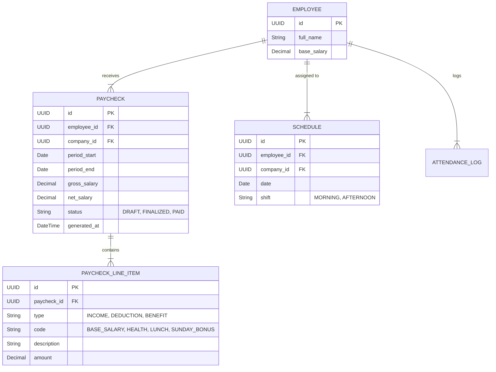

# Data Model: Automated Paycheck Generation

## Conceptual ERD

## Entity Definitions

### 1. Paycheck
- **Role**: Represents a generated salary statement for a specific period.
- **Isolation**: `company_id`.
- **Fields**:
  - `status`: Lifecycle management (allow review before finalizing).
  - `period_start/end`: Defines the scope.

### 2. PaycheckLineItem
- **Role**: Granular breakdown of the paycheck.
- **Isolation**: Implicit via `Paycheck`.
- **Fields**:
  - `amount`: Signed decimal (negative for deductions is a display choice, but usually stored positive with type DEDUCTION). Let's store absolute value and use `type` to determine sign.

### 3. Schedule
- **Role**: Planned shift for an employee.
- **Isolation**: `company_id`.
- **Constraints**:
  - Unique index on `(employee_id, date, shift)` to prevent double booking same slot.

## Updates to Existing Entities

### Employee
- **New Fields**:
  - `base_salary`: Decimal (Required for calculation).
  - `skills`: JSONB or related table (Simple array of strings for MVP: `['STORAGE', 'CASHIER']`).

### PaycheckConfig (Singleton)
- **New Fields** (if not already present):
  - `sunday_bonus_amount`: Decimal.
  - `sales_commission_pct`: Decimal (Global default).

### 4. SalesLog
- **Role**: Records manual sales figures for commission calculation.
- **Isolation**: `company_id`.
- **Fields**:
  - `period_start`: Date.
  - `period_end`: Date.
  - `amount`: Decimal.

### 5. Holiday
- **Role**: Defines public holidays for bonus/deduction logic.
- **Isolation**: `company_id`.
- **Fields**:
  - `date`: Date.
  - `name`: String.
