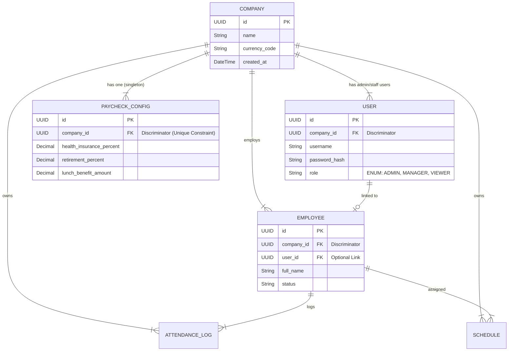

# Data Model: Company Entity & Data Isolation

## Conceptual Entity Relationship Diagram (ERD)

## Entity Definitions

### 1. Company (Root Entity)
- **Role**: The tenant isolation root.
- **Isolation**: Global (no parent).
- **Constraints**:
    - `id`: Unique Identifier (UUID recommended).
    - `currency_code`: Required (ISO 4217).

### 2. User (Authentication)
- **Role**: Credentials and access control.
- **Isolation**: Belongs to `Company`.
- **Fields**:
    - `company_id`: Foreign Key to Company. **REQUIRED**.
    - `username`: Unique *within* Company (or globally, depending on implementation preference, but strictly scoped to Company for this feature).

### 3. Employee (Domain)
- **Role**: HR subject.
- **Isolation**: Belongs to `Company`.
- **Fields**:
    - `company_id`: Foreign Key to Company. **REQUIRED**.

### 4. PaycheckConfig (Configuration)
- **Role**: Global rules for a company.
- **Isolation**: Belongs to `Company`.
- **Constraints**:
    - `company_id`: Unique (One config per company).

## Database Constraints & Isolation

1.  **Foreign Keys**: All entities MUST have a non-nullable `company_id` column referencing `Company(id)` with `ON DELETE CASCADE`.
2.  **Unique Indexes**: 
    - `PaycheckConfig(company_id)` to enforce singleton.
    - `User(company_id, username)` to allow same username in different companies (optional, but good for isolation).
